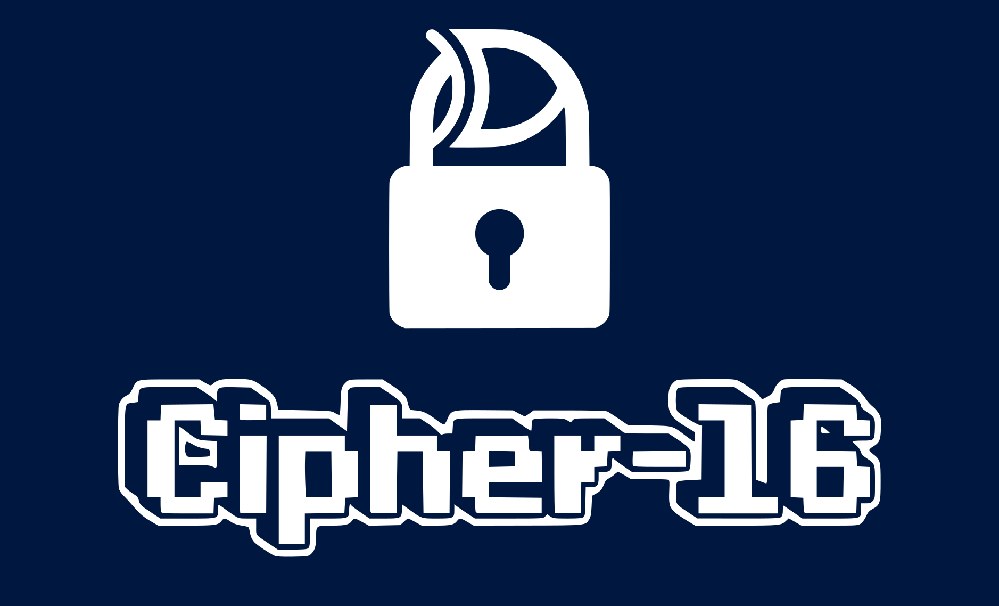

<div align="center">



<p align="center">A 16-bit cryptographic coprocessor in VHDL. It provides dedicated hardware units (S-Boxes, ALU, Shifter) for building cryptographic operations.</p>

</div>

## About

This project is part of the **CSE 226: Hardware Design** course at the Faculty of Engineering, Zagazig University, Computer and Systems Engineering program.

### Architecture

The coprocessor consists of two main blocks:

1. **Datapath:** a 16x16 register file with input register, clock, reset, and control signals (`CTRL`, `Ra`, `Rb`, `Rd`). The register file feeds into a combinational logic block.

2. **Combinational Logic Block:** contains four functional units selected via a MUX:
   - **Nonlinear Lookup Operation Unit:** two S-Boxes (S-Box1, S-Box2) that map a 4-bit input to a 4-bit output each, forming an 8-bit LUT (`LUTin[7:0]` -> `LUTout[7:0]`)
   - **ALU:** arithmetic and logic operations on `ABUS` and `BBUS`
   - **Shifter:** performs bit-level shift/rotate operations:
     - `1000`: 8-bit right rotation (ROR8)
     - `1001`: 4-bit right rotation (ROR4)
     - `1010`: 8-bit left shift (SLL8), zero-filled
     - Other opcodes: output zero
   - **Control Logic:** decodes `CTRL` signals to drive the functional units

### S-Box Tables

#### S-Box 1

| Input  | Output |
|--------|--------|
| `0000` | `0001` |
| `0001` | `1011` |
| `0010` | `1001` |
| `0011` | `1100` |
| `0100` | `1101` |
| `0101` | `0110` |
| `0110` | `1111` |
| `0111` | `0011` |
| `1000` | `1110` |
| `1001` | `1000` |
| `1010` | `0111` |
| `1011` | `0100` |
| `1100` | `1010` |
| `1101` | `0010` |
| `1110` | `0101` |
| `1111` | `0000` |

#### S-Box 2

| Input  | Output |
|--------|--------|
| `0000` | `1111` |
| `0001` | `0000` |
| `0010` | `1101` |
| `0011` | `0111` |
| `0100` | `1011` |
| `0101` | `1110` |
| `0110` | `0101` |
| `0111` | `1010` |
| `1000` | `1001` |
| `1001` | `0010` |
| `1010` | `1100` |
| `1011` | `0001` |
| `1100` | `0011` |
| `1101` | `0100` |
| `1110` | `1000` |
| `1111` | `0110` |

## Prerequisites

- [GHDL](https://github.com/ghdl/ghdl): VHDL compiler and simulator
- [GTKWave](http://gtkwave.sourceforge.net/): Waveform viewer

### Linux

```bash
sudo apt update
sudo apt install -y git make gnat zlib1g-dev gtkwave
```

Build GHDL from source:

```bash
git clone https://github.com/ghdl/ghdl
cd ghdl/
./configure --prefix=/usr/local
make
sudo make install
```

### macOS

Install [GNAT](https://www.adacore.com/download), then add it to your `PATH`:

```bash
export PATH=$HOME/opt/GNAT/2020/bin:$PATH
```

Build GHDL from source (same steps as Linux), then install GTKWave:

```bash
brew install gtkwave
```

## Usage

```bash
# Compile all source files and run testbenches
make

# Compile and simulate a specific entity
make <entity_name>

# Open waveform viewer for simulation results
make simu

# Clean build artifacts
make clean
```

## License

This project is licensed under the [GNU General Public License v3.0](LICENSE).
